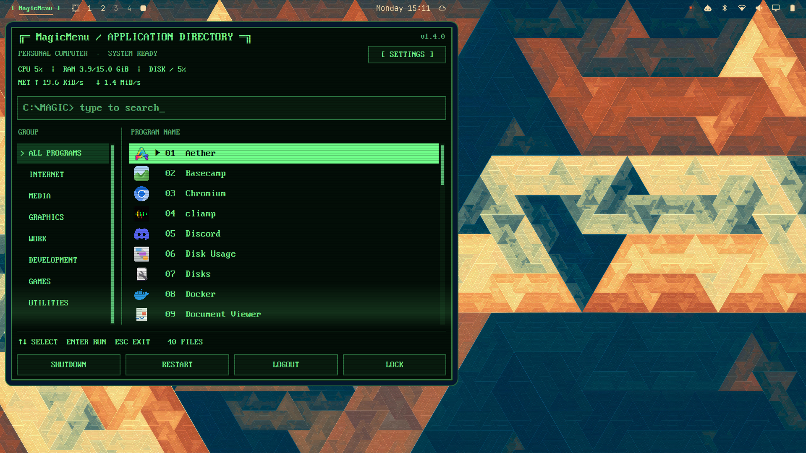
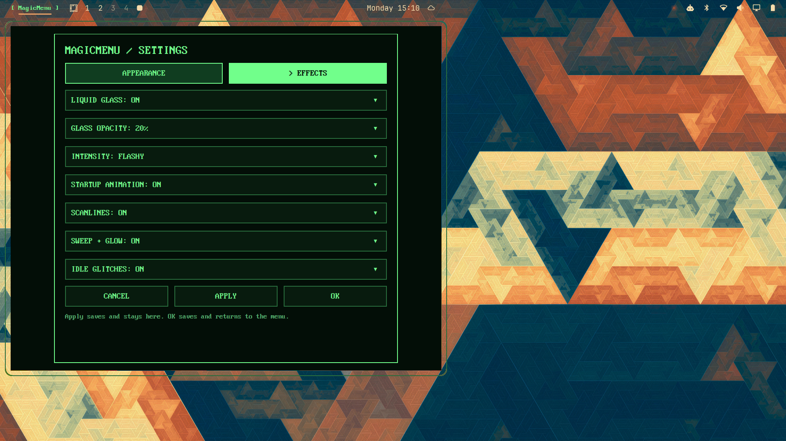

# MagicMenu

By **EZOGuitars**.

A CRT-style application launcher for the Omarchy Quickshell desktop: application search and categories, classic PC fonts, five color palettes, configurable effects, session controls, and live CPU/RAM/disk/network statistics.

## Screenshots

MagicMenu v1.4.0. The top-right label reads the installed version from the plugin manifest.





## Requirements and dependency check

Required at runtime: Omarchy with the Quickshell plugin system and app-library host capability, Quickshell, Python 3, `hyprctl`, the Omarchy shell/system helpers, and Linux procfs/sysfs. This is not a Walker plugin. Ubuntu Mono, Nimbus Mono PS, Liberation Mono and JetBrainsMono Nerd Font are optional system fonts; install them separately if absent. Three IBM fonts are bundled.

Run the bundled preflight before installing or upgrading:

```sh
./check-dependencies.sh
omarchy plugin validate ./magicmenu
```

The preflight checks commands and helper paths that the plugin invokes. It reports Hyprglass separately because it is optional: install and enable the Hyprglass plugin if you want the Liquid Glass setting to have an effect. The normal CRT menu works without Hyprglass. The host app-library capability is checked by `omarchy plugin validate` and should be confirmed with a clean-install smoke test.

## Install a local checkout

```sh
./magicmenu/check-dependencies.sh
omarchy plugin validate ./magicmenu
omarchy plugin add ./magicmenu --enable
```

The stable plugin ID is `magicmike.frontrow` for compatibility with existing MagicMenu installations. Omarchy will reject a second installation with the same ID. Existing users should back up their plugin before replacing it. If a reload does not pick up code changes, run `omarchy restart shell`.

For an upgrade, run the same checks from the new checkout, then reload the shell and open MagicMenu once to verify search, settings, statistics, session actions, and (if installed) Liquid Glass.

## Remove

Disable and remove the installed plugin with:

```sh
omarchy plugin remove magicmike.frontrow
```

The plugin does not remove `~/.config/omarchy/magicmenu.ini`; delete that file separately if you also want to discard saved preferences.

## Use

Click MagicMenu on the bar, search or select a category, then click an application or press Enter. Session buttons execute Shutdown, Restart, Logout or Lock immediately.

Settings has Appearance and Effects tabs. Every setting uses a dropdown. Selections remain pending; the sample previews font, size and color. Apply saves and keeps settings open; OK saves and returns to the menu; Cancel discards pending edits. While settings are open, outside clicks do not close the editor.

Preferences are stored in `~/.config/omarchy/magicmenu.ini`, outside the plugin directory to avoid reloads on save. The path follows the installed plugin directory rather than a hardcoded username. No preferences are included in this package.

## Statistics

Sampling starts on opening. A second sample after 250 ms establishes initial CPU/network rates; subsequent samples occur every two seconds. Sampling stops when closed. CPU measures busy time across all cores; RAM uses MemTotal minus MemAvailable; disk shows space used on `/`. Upload/download rates aggregate physical interfaces and exclude virtual interfaces to avoid counting VPN/bridge traffic twice. Rates are bytes per second, shown in KiB/s or MiB/s, not bits per second. Machines with only virtual interfaces show zero network throughput.

The helper only reads local system counters. It makes no network requests and sends no telemetry.

## License

MagicMenu source code is licensed under the MIT License. Bundled IBM fonts have separate Creative Commons Attribution-ShareAlike terms documented in `THIRD_PARTY_NOTICES.md` and `fonts/`.
